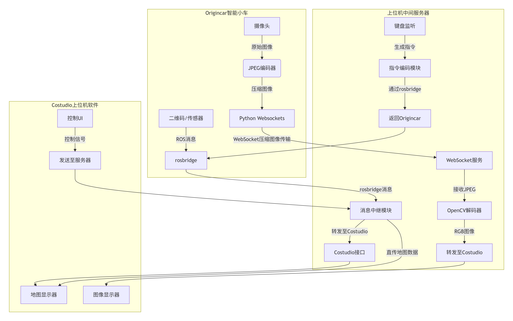

# origincar_proxy_server
Origincar（小车端）、上位机 Websockets 服务器、Costudio 上位机软件之间的高效数据交互与指令控制，核心目标是优化图像与信号传输效率，降低系统延迟。

## 一、核心组件及功能

项目由三个核心部分组成，各部分职责明确且协同配合，形成完整的数据链路与控制闭环：

**1. Origincar 端（小车终端）**

作为数据采集与执行终端，主要负责原始数据发送与接收控制指令：

二维码信号传输：通过rosbridge协议向上位机 Websockets 服务器发送二维码识别信号（rosbridge 是 ROS 系统中用于跨网络通信的协议，支持 ROS 消息的标准化传输）。

图像数据发送：针对/image话题下的图像数据，先进行 JPEG 编码（压缩图像数据量），再通过Python websockets协议向上位机 Websockets 服务器传输（websockets 提供全双工实时通信能力，适合高频图像数据传输）。

**2. 上位机 Websockets 服务器（中间枢纽）**

作为数据中转与处理核心，承担数据转发、图像解码、指令分发的关键角色：

信号转发：接收 Origincar 通过 rosbridge 发送的二维码信号，并转发至 Costudio 上位机软件。

图像处理与转发：接收 Origincar 通过 websockets 发送的 JPEG 编码图像，解码为可处理的图像数据后，转发至 Costudio。

地图发布：直接向 Costudio 上位机软件发布地图数据（推测为小车构建的环境地图，供 Costudio 展示或路径规划使用）。

控制指令回传：监听上位机（可能是用户交互端）的键盘控制事件，将小车运动指令（如前进、转向、停止）通过 rosbridge 协议回传至 Origincar，实现对小车的远程控制。

**3. Costudio 上位机软件（终端交互平台）**

作为用户交互与数据展示终端，主要负责数据接收、状态监控与指令发起：

数据接收：通过 rosbridge 协议从 Websockets 服务器接收图像数据、二维码信号等信息，实现对小车周围环境（图像）和识别结果（二维码）的实时监控。

信号交互：与 Websockets 服务器建立连接，支持接收地图数据、反馈小车状态，并可发起控制信号（通过上位机键盘事件传递给服务器）。

## 二、数据与控制流程

各组件间的通信流程形成 “采集 - 传输 - 处理 - 反馈” 的闭环，具体如下：

**数据上行（Origincar → 服务器 → Costudio）：**

二维码信号：Origincar（rosbridge）→ 上位机 Websockets 服务器 → Costudio（rosbridge）。

图像数据：Origincar（JPEG 编码 + websockets）→ 上位机 Websockets 服务器（解码）→ Costudio（rosbridge）。

地图数据：上位机 Websockets 服务器 → Costudio。

**控制下行（Costudio / 上位机 → 服务器 → Origincar）：**

键盘控制事件：上位机（用户输入）→ 上位机 Websockets 服务器（监听并转换为指令）→ Origincar（rosbridge 接收并执行）。

## 三、项目核心优化

**通信路径优化，降低小车负载：**

上位机软件（如 Costudio 与 Websockets 服务器）之间的通信无需经过 Origincar，减少了小车端的数据转发压力，避免 Origincar 因处理额外通信逻辑而占用计算资源。

**图像传输效率提升，降低延迟：**

采用 JPEG 编码传输图像（相比原始图像，JPEG 压缩后数据量可减少 50%-80%），结合 websockets 的低延迟特性，显著降低了图像传输的带宽占用与延迟，适合实时视觉场景（如导航、环境识别）。

**协议适配性强，兼容性高：**

结合 rosbridge（适配 ROS 生态）与 websockets（适配通用网络通信），既满足了 Origincar 端 ROS 系统的标准化通信需求，又实现了跨平台（小车、服务器、上位机软件）的灵活数据交互。

​
